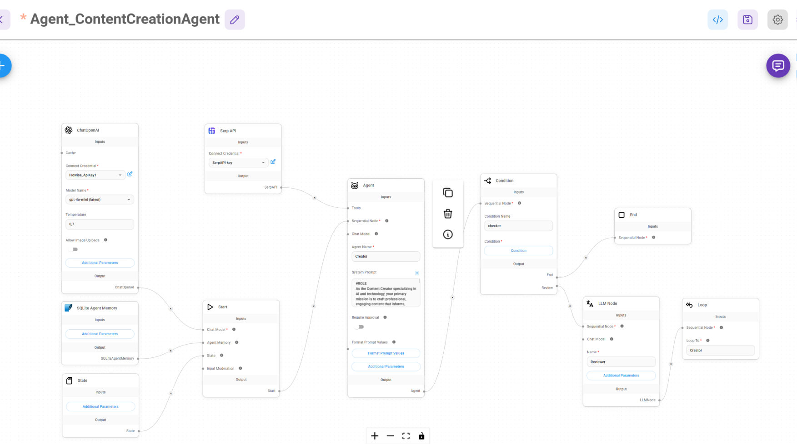

Sequential Content Enhancement Agent 🤖
A Flowise-based sequential agent system that leverages multiple LLMs for content creation and self-improvement.

Overview
This project implements a sequential agent workflow where multiple Large Language Models (LLMs) work together to generate and enhance content. The system consists of:

Content Creation Agent: Primary LLM for generating initial content
Review & Enhancement Agent: Secondary LLM for analyzing and improving the generated content
Sequential processing pipeline for iterative refinement

System Architecture
The workflow consists of several key components:

ChatOpenAI Node: Handles initial content generation
Serp API Integration: Enables real-time data enrichment
Agent Memory System: Maintains context across iterations
Conditional Logic: Controls content flow and improvement cycles
LLM Review Node: Performs quality assessment and enhancement

Features

Self-improving content generation
Multi-stage content review process
Memory retention across iterations
Real-time content enhancement
Quality validation checkpoints
Configurable enhancement parameters

Setup

Clone the Flowise project
Import the provided agent configuration
Configure API credentials:
envCopyOPENAI_API_KEY=your_key_here
SERP_API_KEY=your_key_here

Agent Configuration
Content Creation Agent

Model: gpt-4 or similar
Temperature: 0.7
Enable chat history
Configure system prompt for content generation

Enhancement Agent

Sequential review process
Quality metrics evaluation
Content improvement suggestions
Final output validation

Usage

Start Flowise server
Load the agent configuration
Input your content requirements
Monitor the enhancement pipeline
Review final output

Contributing
Contributions welcome! Please:

Fork the repository
Create a feature branch
Submit a pull request

License
MIT License
